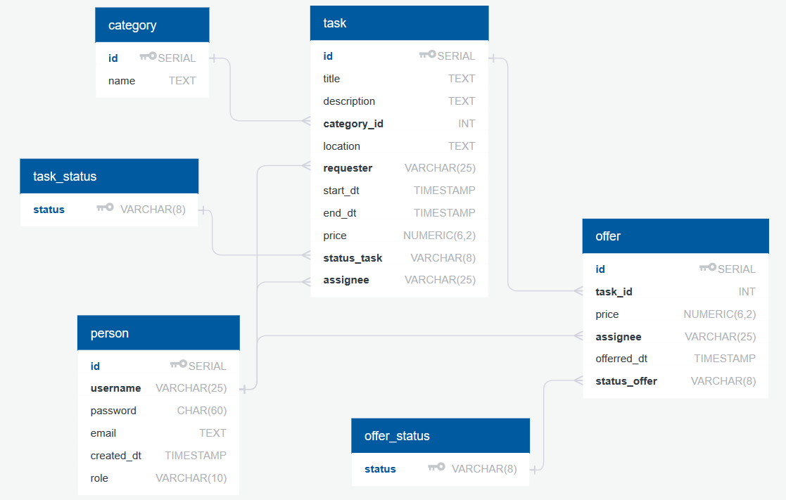
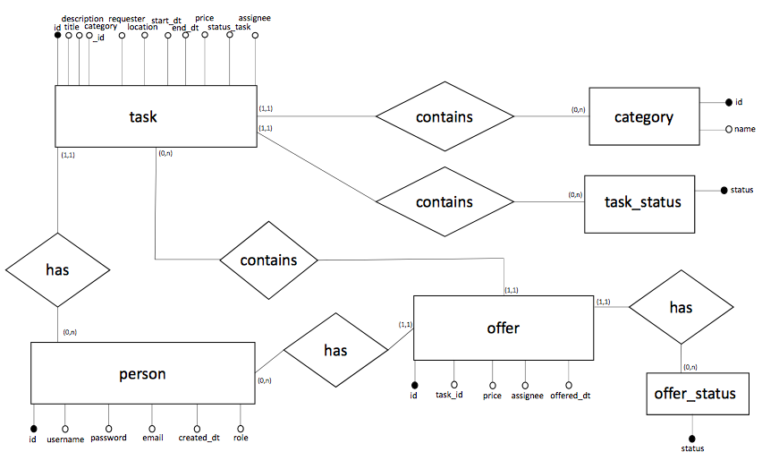

# SQL Documentation

## Database schema:


## ER Diagram:


# Queries
## SQL Commands for the schema

### CREATE queries
#### Person table
```
CREATE TABLE IF NOT EXISTS person (
    id SERIAL PRIMARY KEY,
    username VARCHAR(25) UNIQUE NOT NULL,
    password CHAR(60) NOT NULL,
    email TEXT UNIQUE NOT NULL,
    created_dt TIMESTAMP NOT NULL,
    role VARCHAR(10) DEFAULT 'member' NOT NULL
)
```

#### ... table
