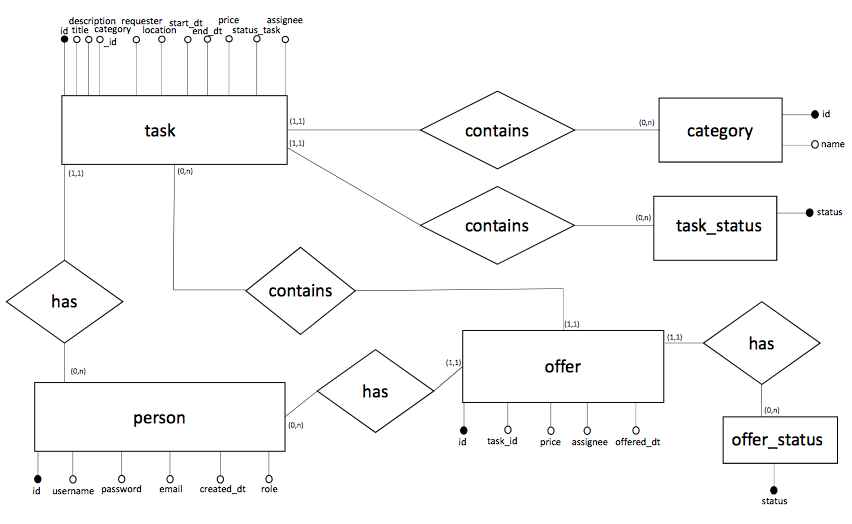

# Taskrr - a Task Sourcing Web Application
## Module Project for CS2102, NUS School of Computing
This is a task matching application (e.g., https://www.taskrabbit.com) to facilitate users to hire temporary help to complete certain tasks. 
Tasks are general chores as such washing a car at Kent Vales car park on Sunday or delivering a parcel on Tuesday between 17:00 and 19:00. 
Users of this application are either looking for help to complete some task or bidding to complete some freelance task. 
The application provides templates for generic common tasks to facilitate task requesters to create new tasks. 
The successful bidder for a task is chosen by the task requester. 
Each user has an account, and administrators can create/modify/delete entries.

## Getting started


## Implemented: 
* User authentication
* Tasks/Offers by user
* Error catching and handling
* Landing page
* Categories page that lists all categories
* Tasks page that lists all tasks

## Database schema:
### ER Diagram:


### DDL
Refer to [our query documentation for more info](./docs/sql.md)

## Routes and APIs:
Refer to [our api documentation for more info](./docs/api.md)


# Getting started
## Prerequisites
This app uses NodeJS. Install NodeJS via your terminal with 

```
sudo apt-get install nodejs
sudo apt-get install npm
```
or on

```
https://nodejs.org/en/download/
```

## Setup

initialise your setup by running

```
$ npm install
```

### Setup database
By default, the application will read your `.env` file for the following parameters:

```
DB_HOST=____
DB_USER=____
DB_PASS=____
DB_PORT=____
DB_DATABASE=____

SESSION_SECRET=____
```

Add a `.env` with the details of those particulars to run the application

### Recommended setup

1. Create/start psql server at:
```
postgres://localhost:5432/cs2102
```

2. Restart the Postgres service (method depends on OS)


3. Enter the development database name, password and user in a '.env' file in root in the following format:

```
DB_HOST=localhost
DB_USER=root
DB_PASS=<<PASSWORD>>
DB_PORT=5432
DB_DATABASE=cs2102

SESSION_SECRET=`thisapplicationisthebest_ohohohohohoohoho`
```
## Running the application
Go to the root of the folder (where app.js is) and type
```
$ node app.js
```
By default, app will run on `localhost` at port `5000`.

You can access the app at
```
http://localhost:5000/
```
in your browser


# Built With
## Configuration
- **Platform:** node
- **Framework**: express
- **Template Engine**: ejs
- **CSS Framework**: bootstrap
- **CSS Preprocessor**: css
- **Database**: postgresql
- **Authentication**: passport, bcrypt
