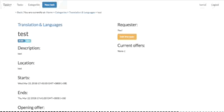

# Taskrr - a Task Sourcing Web Application
[](https://semaphoreci.com/karrui/taskrr-3)

## Module Project for CS2102, NUS School of Computing
This is a task matching application (e.g., https://www.taskrabbit.com) to facilitate users to hire temporary help to complete certain tasks.  
Tasks are general chores as such washing a car at Kent Vales car park on Sunday or delivering a parcel on Tuesday between 17:00 and 19:00.  
Users of this application are either looking for help to complete some task or bidding to complete some freelance task.
The application provides templates for generic common tasks to facilitate task requesters to create new tasks.  
The successful bidder for a task is chosen by the task requester.
Each user has an account, and administrators can create/modify/delete entries.

## Features
### Working authentication


### View tasks


### Edit tasks


### Add offers


AND MORE !!!

## Implemented:
* User authentication
* Tasks/Offers by user
* Error catching and handling
* Landing page
* Categories page that lists all categories
* Tasks page that lists all tasks

### DDL
Refer to [here](./docs/sql.md) for the documentation for the Database Schema and ER diagram.

## Routes and APIs:
Refer to [here](./docs/api.md) for the documentation for the API.


# Getting started
## Prerequisites
This app uses NodeJS. Install NodeJS via your terminal with

```
sudo apt-get install nodejs
sudo apt-get install npm
```
or download from:

```
https://nodejs.org/en/download/
```

## Setup

initialise your setup by running

```
$ npm install
```

### Setup database
By default, the application will read your `.env` file for the following parameters:

```
DB_HOST=____
DB_USER=____
DB_PASS=____
DB_PORT=____
DB_DATABASE=____

SESSION_SECRET=____
```

Add a `.env` with the details of those particulars to run the application

### Recommended setup

1. Start a psql server at:
```
postgres://localhost:5432/cs2102
```

2. Restart the Postgres service (method depends on OS)


3. Enter the development database name, password and user in a `.env` file in root in the following format:

```
DB_HOST=localhost
DB_USER=root
DB_PASS=____
DB_PORT=5432
DB_DATABASE=cs2102

REMOTE_HOST=192.168.1.120
REMOTE_DEST_PORT=6000

SESSION_SECRET=thisapplicationisthebest_ohohohohohoohoho
```
## Running the application
Go to the root of the folder (where app.js is) and type
```
$ node app.js
```
By default, app will run on `localhost` at port `5000`.

From your browser, you can access the app at:
```
http://localhost:5000/
```

## Testing
The tests are only applicable for the SQL functions, and can only run with Python.

#### 1. Install the Python's dependencies:
```
pip install -r requirements.txt
```

#### 2. Create a `pytest.ini` file in `test/` in the format:

```
[pytest]
env =
    IP_ADDR=____
    SSH_USERNAME=____
    SSH_PASSWORD=____
    DATABASE=____
    DB_USERNAME=____
    DB_PASSWORD=____
```

#### 3. Run the test with `pytest`:

```
pytest -c test/pytest.ini -v -s
```
Option parameters:
- `-c`: use a `pytest.ini` file.
- `-v`: show all test functions, not just filenames.
- `-s`: show all stdout by in the tests.

# Built With
## Configuration
- **Platform:** node
- **Framework**: express
- **Testing Framework**: pytest
- **Template Engine**: ejs
- **CSS Framework**: bootstrap
- **CSS Preprocessor**: css
- **Database**: postgresql
- **Authentication**: passport, bcrypt
